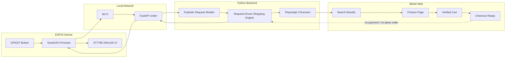

# SnackOS

<p align="center">
  <strong>One button. One tiny screen. A local automation engine that prepares your snack cart.</strong>
</p>

<p align="center">
  <code>[ Project logo placeholder: images/logo.svg ]</code>
</p>

<p align="center">
  <a href="LICENSE"></a>
  <a href="#"></a>
  <a href="#"></a>
  <a href="#"></a>
  <a href="#"></a>
  <a href="#"></a>
  <a href="#"></a>
  <a href="#"></a>
</p>

SnackOS is an embedded-to-browser automation project that turns a physical ESP32
button press into a structured shopping request. The device owns the tactile UI:
boot animation, Wi-Fi state, order state, and error feedback on a compact ST7789
display. The backend owns the hard parts: request validation, product matching,
cart quantity verification, and safe browser automation.

The ESP32 never knows Blinkit selectors, product URLs, browser state, cookies, or
checkout details. It only sends a shopping list to a local FastAPI endpoint.

> Safety boundary: SnackOS prepares the cart and reaches the checkout-ready
> screen. It does not click payment controls and does not place the final order.

---

## Demo

| Demo Asset | Status |
| --- | --- |
| Product walkthrough GIF | `images/demo.gif` placeholder |
| ESP32 boot animation | `images/boot.gif` placeholder |
| Checkout-ready automation | `images/checkout-ready.gif` placeholder |

```text
[ Demo GIF placeholder ]
ESP32 button press -> FastAPI request -> Playwright cart preparation -> checkout ready
```

## Screenshots

| Screen | Placeholder |
| --- | --- |
| Boot | `images/screenshots/boot.png` |
| Connecting Wi-Fi | `images/screenshots/wifi.png` |
| Ready | `images/screenshots/ready.png` |
| Order placed | `images/screenshots/order-placed.png` |
| Server offline | `images/screenshots/server-offline.png` |

Generated debug screenshots are ignored by Git. Public screenshots should be
sanitized before being added.

## Why SnackOS?

SnackOS is a compact reference project for real-world, multi-layer automation:

- embedded UI and hardware input
- Wi-Fi and HTTP on ESP32
- local Python API orchestration
- browser automation with a persistent profile
- safety guards around checkout and payment
- structured JSON responses back to firmware

## Feature Comparison

| Capability | SnackOS | Typical Button Script | Generic Browser Bot |
| --- | --- | --- | --- |
| Physical hardware trigger | Yes | Sometimes | No |
| Embedded TFT UI | Yes | No | No |
| Request-driven shopping list | Yes | Rarely | Sometimes |
| ESP32 isolated from selectors | Yes | No | Not applicable |
| Persistent login profile | Yes | Often ad hoc | Often |
| Exact quantity verification | Yes | Often missing | Varies |
| Stops before payment | Yes | Varies | Varies |
| Structured API response | Yes | No | Varies |
| Open-source docs and safety notes | Yes | Rarely | Varies |

## Architecture



## Request Lifecycle

```text
Button press
  -> ESP32 POST /order
  -> FastAPI validates shopping list
  -> Playwright launches persistent Chromium profile
  -> Blinkit login is verified
  -> Each item is searched and matched by query + price
  -> Quantity is adjusted and re-read from the UI
  -> Cart is opened and verified
  -> Safe Proceed / Continue button is clicked
  -> Backend returns structured JSON
  -> ESP32 displays success or error
```

## Folder Structure

```text
SnackOS/
├── SnackOS.ino                # Arduino IDE sketch entry
├── main.ino                   # Firmware state machine
├── config.example.h           # Safe public config template
├── api.cpp / api.h            # ESP32 HTTP API client
├── wifi.cpp / wifi.h          # Wi-Fi manager
├── display.cpp / display.h    # ST7789 wrapper
├── ui.cpp / ui.h              # TFT rendering
├── button.cpp / button.h      # Debounced button input
├── state.h                    # Firmware state definitions
├── server/
│   ├── main.py                # FastAPI application
│   ├── blinkit_automation.py  # Playwright shopping engine
│   └── requirements.txt       # Python dependencies
├── docs/
│   ├── API.md
│   ├── Architecture.md
│   ├── Development.md
│   └── Hardware.md
├── images/
│   └── .gitkeep
├── .github/
│   ├── ISSUE_TEMPLATE/
│   └── pull_request_template.md
├── CONTRIBUTING.md
├── SECURITY.md
├── LICENSE
└── README.md
```

## Hardware Overview

| Component | Role |
| --- | --- |
| ESP32 Dev Module | Firmware runtime, Wi-Fi, GPIO input, display control |
| ST7789 240x135 TFT | SnackOS UI |
| Momentary push button | Physical order trigger |
| USB power | Development power and serial logging |

### Wiring

| ST7789 | ESP32 |
| --- | --- |
| CS | GPIO15 |
| DC | GPIO2 |
| RST | GPIO4 |
| SCK | GPIO18 |
| MOSI | GPIO23 |

| Button | ESP32 |
| --- | --- |
| Signal | GPIO27 |
| Other side | GND |

GPIO27 uses `INPUT_PULLUP`, so pressed is `LOW`.

## Software Stack

| Layer | Stack |
| --- | --- |
| Firmware | Arduino ESP32 core |
| Display | Adafruit GFX, Adafruit ST7789 |
| Firmware JSON | ArduinoJson |
| Backend API | Python, FastAPI, Pydantic, Uvicorn |
| Automation | Playwright for Python, Chromium |
| Auth state | Local persistent Chromium profile |

## Quick Start

### 1. Clone

```bash
git clone https://github.com/your-org/snackos.git
cd snackos
```

### 2. Create Local Firmware Config

```bash
cp config.example.h config.h
```

Edit `config.h`:

```cpp
constexpr const char* WIFI_SSID = "YOUR_WIFI_SSID";
constexpr const char* WIFI_PASSWORD = "YOUR_WIFI_PASSWORD";
constexpr const char* SERVER_URL = "http://YOUR_LOCAL_IP:8000/order";
```

`config.h` is ignored and should never be committed.

### 3. Install Backend

```bash
cd server
python3 -m venv .venv
. .venv/bin/activate
pip install -r requirements.txt
playwright install chromium
```

### 4. Log Into Blinkit Manually

```bash
cd server
. .venv/bin/activate
python - <<'PY'
import asyncio
from blinkit_automation import login_blinkit

asyncio.run(login_blinkit())
PY
```

Log in, then close Chromium. The profile is stored locally at
`server/blinkit-profile/` and ignored by Git.

### 5. Start Backend

```bash
cd server
. .venv/bin/activate
uvicorn main:app --host 0.0.0.0 --port 8000
```

### 6. Flash ESP32

Open `SnackOS.ino` in Arduino IDE, select your ESP32 board, and upload.

## Installation Guide

### Firmware Dependencies

Install these Arduino libraries:

- Adafruit GFX
- Adafruit ST7789
- ArduinoJson

The ESP32 Arduino core supplies `WiFi.h`, `HTTPClient.h`, and `SPI.h`.

### Backend Dependencies

Dependencies are pinned in `server/requirements.txt`:

```text
fastapi
uvicorn[standard]
playwright
```

## API Examples

### Health Check

```bash
curl http://localhost:8000/
```

```text
SnackOS Server Running
```

### Place Shopping Request

```bash
curl -X POST http://localhost:8000/order \
  -H "Content-Type: application/json" \
  -d '{
    "items": [
      {
        "query": "Uncle Chipps Spicy Treat",
        "price": 20,
        "quantity": 2
      },
      {
        "query": "Cadbury Dairy Milk Fruit & Nut",
        "price": 50,
        "quantity": 2
      }
    ]
  }'
```

### Success Response

```json
{
  "success": true,
  "checkout_ready": true,
  "items": [
    {
      "query": "Uncle Chipps Spicy Treat",
      "matched_title": "Uncle Chipps Spicy Treat Flavour Potato Chips 53 g ₹20 2",
      "price": 20,
      "quantity": 2,
      "status": "added"
    },
    {
      "query": "Cadbury Dairy Milk Fruit & Nut",
      "matched_title": "Cadbury Dairy Milk Fruit & Nut Chocolate Bar Cricket Pack 36 g ₹50 2",
      "price": 50,
      "quantity": 2,
      "status": "added"
    }
  ],
  "eta": "Blinkit Checkout Ready",
  "cart_total": "₹140",
  "message": "Cart prepared successfully."
}
```

### Structured Failure

```json
{
  "success": false,
  "checkout_ready": false,
  "stage": "add_item",
  "failed_item": {
    "query": "Example Product",
    "price": 10,
    "quantity": 1
  },
  "items": [],
  "error": "Failed to add requested item 'Example Product': No confident product match",
  "eta": "Failed to add requested item 'Example Product': No confident product match"
}
```

## Safety Guarantees

| Safety Rule | Status |
| --- | --- |
| ESP32 never stores Blinkit selectors | Enforced by architecture |
| Browser login stays local | `server/blinkit-profile/` is ignored |
| Local Wi-Fi credentials are not committed | `config.h` is ignored |
| Quantity is verified before checkout | Implemented in automation flow |
| Payment buttons are not clicked | Guarded by forbidden checkout patterns |
| Final order is not placed | The flow stops at checkout readiness |
| Debug screenshots/HTML are not committed | Ignored by `.gitignore` |

## Performance Notes

- The backend uses a persistent Chromium profile to avoid repeated login.
- Product matching inspects visible cards and favors exact price matches.
- The firmware uses non-blocking state transitions for runtime behavior.
- Network idle can time out on modern commerce pages; the automation continues
  from visible UI state when safe to do so.
- First Playwright launch is slower than subsequent launches because Chromium
  may warm caches.

## Roadmap

| Stage | Work |
| --- | --- |
| v0.1 | Public release docs, hardware wiring, local backend setup |
| v0.2 | Test harness for product ranking and cart parsing |
| v0.3 | Optional mock commerce site for CI |
| v0.4 | Web dashboard for shopping list presets |
| v0.5 | Captive portal Wi-Fi setup for firmware |
| v1.0 | Stable hardware enclosure, signed release artifacts, CI validation |

## Future Plans

- Add CI for Python compile/import checks.
- Add a firmware compile guide for Arduino CLI.
- Add a safe simulated shopping backend for contributors without Blinkit access.
- Add sanitized screenshots and a short build video.
- Add support abstractions for multiple grocery platforms.

## Troubleshooting

<details>
<summary>ESP32 cannot reach the backend</summary>

Use your computer's LAN IP in `SERVER_URL`. `localhost` points to the ESP32
itself, not your development machine.

</details>

<details>
<summary>Backend says Blinkit login is required</summary>

Run the manual login helper and log in through the opened Chromium window. Close
the browser after login is complete.

</details>

<details>
<summary>The cart is not verified</summary>

Blinkit UI may have changed, an item may be out of stock, or the visible product
price may differ from the request. Check backend logs and generated local debug
artifacts. Do not commit those artifacts.

</details>

<details>
<summary>The TFT is blank</summary>

Check power, ground, SPI wiring, and the ST7789 dimensions in `config.h`. The
current firmware targets a 240x135 panel.

</details>

<details>
<summary>Playwright installation fails</summary>

Confirm the virtual environment is active, then run:

```bash
playwright install chromium
```

</details>

## FAQ

<details>
<summary>Does SnackOS place the final order?</summary>

No. SnackOS prepares the cart and stops at checkout readiness. It does not click
payment or final order placement controls.

</details>

<details>
<summary>Can the ESP32 request different products?</summary>

Yes. The backend API accepts a shopping list with query, price, and quantity.
The ESP32 does not need to know browser automation details.

</details>

<details>
<summary>Can this support another grocery platform?</summary>

Yes, but platform-specific browser logic should live behind a backend adapter.
See [docs/Development.md](docs/Development.md).

</details>

<details>
<summary>Why is the browser profile ignored?</summary>

It contains authentication state, cookies, local storage, and session data. It
must remain local.

</details>

## Documentation

- [Architecture](docs/Architecture.md)
- [API Reference](docs/API.md)
- [Hardware Guide](docs/Hardware.md)
- [Development Guide](docs/Development.md)
- [Contributing](CONTRIBUTING.md)
- [Security](SECURITY.md)

## Acknowledgements

SnackOS builds on excellent open-source tools:

- Arduino ESP32 core
- Adafruit GFX
- Adafruit ST7789
- ArduinoJson
- FastAPI
- Pydantic
- Uvicorn
- Playwright

## License

SnackOS is released under the [MIT License](LICENSE).

