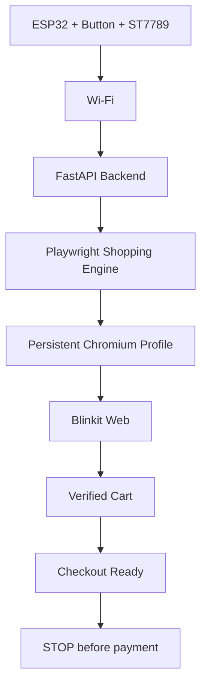
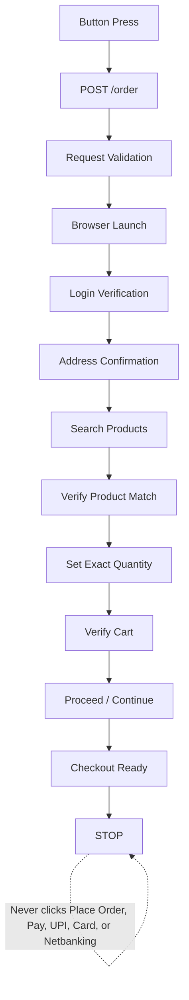

# SnackOS

Turn an ESP32 into a one-button Blinkit ordering device.

Press a physical button. SnackOS sends a request to your local FastAPI server, starts Playwright with your persistent Blinkit profile, waits for you to confirm the delivery address in the browser, searches products intelligently, verifies exact quantities, prepares the cart, and safely stops before payment.

<p align="center">
  
  
  
  
  
  
</p>

> [!IMPORTANT]
> SnackOS prepares the Blinkit cart and reaches a checkout-ready state. It does not click payment controls and does not place the final order.

---

## Features

|  | Capability |
| --- | --- |
| ✅ | ESP32 hardware interface with physical button input |
| ✅ | ST7789 240x135 embedded UI for boot, Wi-Fi, ready, order, and error states |
| ✅ | Local FastAPI backend with structured request validation |
| ✅ | Human-like Blinkit automation through Playwright Chromium |
| ✅ | Interactive delivery address selection in the live browser |
| ✅ | Dynamic product search with no hardcoded product URLs |
| ✅ | Product matching by query, keywords, title similarity, availability, and exact price |
| ✅ | Exact quantity verification from the rendered Blinkit UI |
| ✅ | Cart verification before checkout navigation |
| ✅ | Checkout-safe architecture that blocks payment and final order actions |
| ✅ | Persistent browser profile so Blinkit login remains local |
| ✅ | ESP32 stays isolated from Blinkit selectors, cookies, and browser details |

---

## Architecture



SnackOS is split into two clear responsibilities:

| Layer | Responsibility |
| --- | --- |
| ESP32 firmware | Hardware input, TFT UI, Wi-Fi, and HTTP request dispatch |
| FastAPI backend | Request validation, browser orchestration, product matching, quantity checks, and checkout boundary enforcement |

The ESP32 never needs to know product names, Blinkit URLs, selectors, cookies, or checkout UI details. It sends a shopping list. The backend handles the web automation.

---

## Workflow



The address stage is intentionally human-in-the-loop. SnackOS opens the address selector, highlights the relevant panel, observes the active delivery address, and continues only after the browser shows a valid active address.

---

## Why SnackOS

SnackOS is designed as a hardware-first automation system rather than a hidden background bot.

| Principle | What it means |
| --- | --- |
| No Blinkit APIs | SnackOS uses the public Blinkit website through browser automation. |
| Human-like interaction | Product search, selection, cart changes, and checkout navigation happen through Chromium. |
| Hardware-first interface | A real button and a tiny TFT make the ordering flow tangible. |
| Backend isolation | The ESP32 only talks to a REST API and stays unaware of Blinkit internals. |
| Safety-first checkout boundary | Automation stops at checkout readiness and avoids payment/final-order controls. |

This makes the project useful as a reference for embedded UI, local APIs, browser automation, and careful safety boundaries around real commerce sites.

---

## Safety

SnackOS never clicks:

| Forbidden action | Status |
| --- | --- |
| Place Order | Blocked |
| Pay | Blocked |
| UPI | Blocked |
| Card | Blocked |
| Netbanking | Blocked |
| Payment methods | Blocked |

SnackOS only prepares and verifies the cart. The final purchase decision remains with the user.

Additional safeguards:

- The persistent Blinkit profile is local and ignored by Git.
- Wi-Fi credentials live in `config.h`, which is ignored by Git.
- Product URLs are not hardcoded in the shopping flow.
- Cart quantities are verified from the visible UI after changes.
- The checkout button is treated as the final safe automation boundary.

---

## Project Structure

```text
SnackOS/
├── SnackOS.ino
├── main.ino
├── config.example.h
├── api.cpp / api.h
├── wifi.cpp / wifi.h
├── display.cpp / display.h
├── ui.cpp / ui.h
├── button.cpp / button.h
├── state.h
├── server/
│   ├── main.py
│   ├── blinkit_automation.py
│   └── requirements.txt
├── docs/
│   ├── API.md
│   ├── Architecture.md
│   ├── Development.md
│   └── Hardware.md
├── images/
├── .github/
│   ├── ISSUE_TEMPLATE/
│   └── pull_request_template.md
├── CONTRIBUTING.md
├── SECURITY.md
├── LICENSE
└── README.md
```

| Path | Purpose |
| --- | --- |
| `SnackOS.ino`, `main.ino` | Arduino IDE entrypoints and firmware state machine |
| `api.*` | ESP32 HTTP client for the local backend |
| `wifi.*` | ESP32 Wi-Fi connection management |
| `display.*` | ST7789 display setup and low-level drawing wrapper |
| `ui.*` | Embedded UI screens and animations |
| `button.*` | Debounced GPIO27 button input |
| `state.h` | Firmware state definitions |
| `server/main.py` | FastAPI app and API models |
| `server/blinkit_automation.py` | Playwright shopping engine |
| `docs/` | Architecture, API, hardware, and development documentation |
| `.github/` | Issue and pull request templates |
| `images/` | Public screenshots and visual assets when sanitized |

---

## Hardware

| Component | Role |
| --- | --- |
| ESP32 Dev Module | Firmware runtime, Wi-Fi, GPIO input, and display control |
| ST7789 240x135 TFT | SnackOS embedded UI |
| Momentary push button | Physical order trigger |
| USB power/data | Power, flashing, and serial logs |

### Wiring

| ST7789 Pin | ESP32 GPIO |
| --- | --- |
| CS | GPIO15 |
| DC | GPIO2 |
| RST | GPIO4 |
| SCK | GPIO18 |
| MOSI | GPIO23 |

| Button | ESP32 |
| --- | --- |
| Signal | GPIO27 |
| Other side | GND |

GPIO27 uses `INPUT_PULLUP`, so the pressed state is `LOW`.

---

## Installation

### Firmware

Install the ESP32 Arduino core in Arduino IDE, then install these libraries:

```text
Adafruit GFX
Adafruit ST7789
ArduinoJson
```

Create your local firmware config:

```bash
cp config.example.h config.h
```

Edit `config.h`:

```cpp
constexpr const char* WIFI_SSID = "YOUR_WIFI_SSID";
constexpr const char* WIFI_PASSWORD = "YOUR_WIFI_PASSWORD";
constexpr const char* SERVER_URL = "http://YOUR_COMPUTER_LAN_IP:8000/order";
```

`config.h` is intentionally ignored because it contains local credentials.

### Backend

```bash
cd server
python3 -m venv .venv
. .venv/bin/activate
pip install -r requirements.txt
```

### Playwright

```bash
cd server
. .venv/bin/activate
playwright install chromium
```

Log into Blinkit once using the persistent Chromium profile:

```bash
cd server
. .venv/bin/activate
python - <<'PY'
import asyncio
from blinkit_automation import login_blinkit

asyncio.run(login_blinkit())
PY
```

The browser profile is stored at `server/blinkit-profile/` and must never be committed.

### Running

Start the backend:

```bash
cd server
. .venv/bin/activate
uvicorn main:app --host 0.0.0.0 --port 8000
```

Flash the ESP32:

```text
Open SnackOS.ino in Arduino IDE
Select your ESP32 board
Select the correct serial port
Upload
```

Press the physical button after the device reaches the READY screen.

---

## API

### Endpoints

| Method | Path | Description |
| --- | --- | --- |
| `GET` | `/` | Health check |
| `POST` | `/order` | Validate a shopping list and prepare the Blinkit cart |

### `GET /`

Response:

```text
SnackOS Server Running
```

### `POST /order`

Request body:

```json
{
  "items": [
    {
      "query": "Uncle Chipps Spicy Treat",
      "price": 20,
      "quantity": 2
    },
    {
      "query": "Cadbury Dairy Milk Fruit & Nut",
      "price": 50,
      "quantity": 2
    }
  ]
}
```

Request fields:

| Field | Type | Required | Description |
| --- | --- | --- | --- |
| `items` | array | Yes | Shopping list processed in order |
| `items[].query` | string | Yes | Human search query used on Blinkit |
| `items[].price` | integer | Yes | Expected product price in rupees |
| `items[].quantity` | integer | Yes | Desired cart quantity, from 1 to 20 |

Success response:

```json
{
  "success": true,
  "checkout_ready": true,
  "items": [
    {
      "query": "Uncle Chipps Spicy Treat",
      "matched_title": "Uncle Chipps Spicy Treat Flavour Potato Chips",
      "price": 20,
      "quantity": 2,
      "status": "added"
    }
  ],
  "eta": "Blinkit Checkout Ready",
  "cart_total": "₹40",
  "message": "Cart prepared successfully."
}
```

Response fields:

| Field | Type | Description |
| --- | --- | --- |
| `success` | boolean | Whether the automation completed successfully |
| `checkout_ready` | boolean | Whether the browser reached the checkout-ready boundary |
| `items` | array | Per-item result details |
| `items[].query` | string | Original requested query |
| `items[].matched_title` | string | Product title selected from Blinkit |
| `items[].price` | integer | Expected price used for matching |
| `items[].quantity` | integer | Verified target quantity |
| `items[].status` | string | Item processing status |
| `eta` | string or null | Firmware-facing status text |
| `cart_total` | string or null | Visible cart total when detected |
| `message` | string or null | Human-readable result summary |

Failure responses are structured and include the failing stage or error message when available.

---

## Screenshots

| Area | Gallery Slot |
| --- | --- |
| ESP32 Interface | Add screenshot here |
| Blinkit Search | Add screenshot here |
| Cart Verification | Add screenshot here |
| Checkout Ready | Add screenshot here |

Sanitize screenshots before publishing. Do not include addresses, phone numbers, cookies, browser profile data, or order details.

---

## Troubleshooting

| Problem | What to check |
| --- | --- |
| ESP32 cannot reach the backend | Use your computer's LAN IP in `SERVER_URL`; `localhost` points to the ESP32 itself. |
| Backend says login is required | Run `login_blinkit()` and complete login in the opened Chromium window. |
| Address selection does not continue | Ensure the Blinkit page shows an active delivery address after choosing it. |
| Product is not matched | Confirm the query, expected price, availability, and visible search result text. |
| Cart verification fails | Check backend logs and inspect any local failure HTML/screenshot artifacts. |
| TFT is blank | Verify power, ground, ST7789 wiring, and board selection in Arduino IDE. |

---

## Documentation

| Document | Description |
| --- | --- |
| [Architecture](docs/Architecture.md) | System design, request lifecycle, automation safety, and checkout boundary |
| [Hardware](docs/Hardware.md) | ESP32 wiring, button setup, display notes, and power guidance |
| [Development](docs/Development.md) | Local workflow, coding conventions, and platform extension notes |
| [API](docs/API.md) | Endpoint reference and request/response examples |
| [Contributing](CONTRIBUTING.md) | Contribution workflow and pull request expectations |
| [Security](SECURITY.md) | Credential, browser profile, and responsible disclosure guidance |

---

## Built With

| Layer | Tools |
| --- | --- |
| Hardware | ESP32, ST7789, push button |
| Firmware | Arduino ESP32 core, Adafruit GFX, Adafruit ST7789, ArduinoJson |
| Backend | Python, FastAPI, Pydantic, Uvicorn |
| Automation | Playwright, Chromium |

## License

SnackOS is released under the [MIT License](LICENSE).

---

⭐ If you like this project, consider starring the repository.
