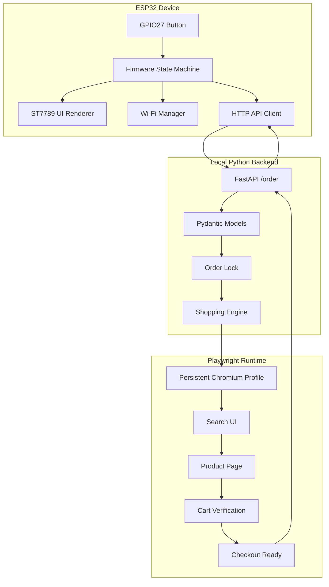

# SnackOS Architecture

SnackOS is built around a hard separation of responsibilities:

- the ESP32 owns the physical interaction and local UI
- FastAPI owns request validation and response formatting
- Playwright owns browser automation
- Blinkit-specific details stay in the backend

The ESP32 does not know product URLs, browser selectors, cookies, local storage,
or checkout internals.

## System Overview



## ESP32 Flow

1. Boot and initialize Serial logging.
2. Initialize ST7789 display and render boot UI.
3. Connect to Wi-Fi using local `config.h`.
4. Display assigned IP address.
5. Enter READY state.
6. Wait for the GPIO27 button press.
7. Send `POST /order` to `SERVER_URL`.
8. Display success or error response from the backend.
9. Return to READY.

Firmware modules:

| Module | Responsibility |
| --- | --- |
| `display.*` | ST7789 initialization and drawing primitives |
| `ui.*` | Screens and animation rendering |
| `wifi.*` | Wi-Fi connection lifecycle |
| `api.*` | HTTP POST and JSON response handling |
| `button.*` | Debounced button input |
| `state.h` | State definitions |

## Backend Flow

1. `POST /order` receives a shopping list.
2. Pydantic validates `query`, `price`, and `quantity`.
3. An async lock serializes automation runs.
4. The shopping engine receives normalized items.
5. A structured success or failure response is returned.

The backend is intentionally the only layer that understands browser automation.

## Browser Automation Flow

1. Launch Chromium with `server/blinkit-profile/`.
2. Verify login without automating credential entry.
3. Open Blinkit home.
4. Discover the search UI.
5. Search for the requested item.
6. Inspect visible product cards.
7. Score products by title similarity, query term overlap, availability, and exact price.
8. Open the best match.
9. Add or adjust quantity.
10. Re-read quantity from the UI.
11. Repeat for every requested item.
12. Open cart from the visible cart summary.
13. Verify every requested item and quantity.
14. Click only a safe `Proceed`, `Continue`, or checkout-ready control.
15. Stop before payment or final order placement.

## Request Lifecycle

```text
Physical button
  ↓
Firmware state machine
  ↓
HTTP POST /order
  ↓
FastAPI validation
  ↓
Shopping engine target normalization
  ↓
Playwright browser session
  ↓
Product search and matching
  ↓
Quantity correction and verification
  ↓
Cart verification
  ↓
Safe checkout-ready action
  ↓
Structured JSON response
  ↓
TFT success or error UI
```

## Error Handling

The backend returns structured failures with:

- `success: false`
- `checkout_ready: false`
- failing `stage`
- `failed_item`, when item-specific
- partial successful `items`
- human-readable `error`

Automation failures also save local diagnostics:

```text
failure.png
failure.html
```

These files are ignored by Git because they may contain private account state.

## Safety Mechanisms

| Risk | Mitigation |
| --- | --- |
| Browser profile committed | `server/blinkit-profile/` ignored |
| Wi-Fi credentials committed | `config.h` ignored |
| Debug account HTML committed | `*.html` ignored |
| Debug screenshots committed | `*.png` ignored |
| Payment clicked accidentally | Forbidden click patterns |
| Final order placed accidentally | Checkout flow stops before final order action |
| ESP32 tied to Blinkit internals | Request-driven API boundary |
| Wrong product selected | Query scoring plus exact price matching |
| Wrong quantity | Quantity re-read after every change and verified in cart |

## Quantity Verification Strategy

SnackOS never assumes the cart is empty and never trusts a stale quantity.

For each requested product:

1. Read the visible quantity from product UI controls.
2. If missing, click the detected Add control.
3. Re-read quantity from the UI.
4. If below requested quantity, click increment one step at a time.
5. If above requested quantity, click decrement one step at a time.
6. After every click, wait for UI confirmation.
7. Continue only when the displayed quantity equals the requested quantity.

Cart verification then checks the final item rows again.

## Search-Based Product Matching

The engine does not use hardcoded product URLs. It searches like a user:

1. Type the request query.
2. Wait for visible results.
3. Collect visible product cards.
4. Score each candidate using:
   - title similarity
   - query token overlap
   - exact price match
   - availability
5. Reject weak matches.
6. Choose the highest-scoring product.

This allows the backend to keep working when product URLs change.

## Checkout Stopping Logic

SnackOS is allowed to click only a safe proceed/continue control that reaches a
checkout-ready state. It must not click:

- payment controls
- UPI controls
- card controls
- net banking controls
- pay-now controls
- final order placement controls

The automation contains guard patterns that refuse unsafe labels.

## Persistent Browser Profile

Manual login is preserved in:

```text
server/blinkit-profile/
```

This directory contains cookies and session state. It must never be committed,
shared, or uploaded in issue reports.

